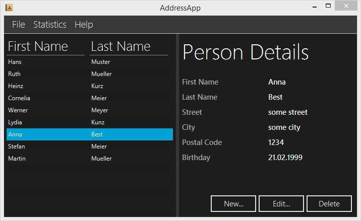

# Java FX Address Book (Modular JDK17 with FX17)

| [Intro](README.md)
| [1 Scene Builder](readme/part1.md)
| [2 Model and TableView](readme/part2.md)
| [3 Interacting](readme/part3.md)
| [4 CSS](readme/part4.md)
| [5 XML](readme/part5.md)
| [6 Statics](readme/part6.md)
| [7 Deployment](readme/part7.md)
|

The original [_Java FX Address Book_](https://code.makery.ch/library/javafx-tutorial/ )  tutorial has been created by _Marco Jakob_ based on Eclipse with _Oracle JDK 8_.
Many people all over the world have been reading the tutorial and gave very positive feedback.
Unfortunately the tutorial has not been maintained to later versions of JDK and Java FX.

This updated [tutorial](https://github.com/mbachmann/java-fx-address-book) is based on  **JDK 17** with **modular Java**, **Java FX 17** and **Maven**. Make sure your tool stack is properly installed.
For installing a _Java Development Environment_ based on **Jet Brains IntelliJ** you can refer to
this [tutorial](https://github.com/mbachmann/java-development-environment-installation). The configuration
of Eclipse can be found [here](readme/eclipse.md).

The _Address Book Tutorial_ walks you through designing, programming and deploying an address application.
This is how the final application will look like:

 

## Structure of this tutorial

- [Part 1: Scene Builder](readme/part1.md)
- [Part 2: Model and TableView](readme/part2.md)
- [Part 3: Interacting with the User](readme/part3.md)
- [Part 4: CSS Styling](readme/part4.md)
- [Part 5: Storing Data as XML](readme/part5.md)
- [Part 6: Statics Data](readme/part6.md)
- [Part 7: Deployment](readme/part7.md)

The results of each step are available as a separate branch in this repository. It allows you to verify your source code.

##  What you will learn

- Creating and starting a JavaFX project
- Using Scene Builder to design the user interface
- Structuring an application with the Model-View-Controller (MVC) pattern
- Using ObservableLists for automatically updating the user interface
- Using TableView and reacting to selection changes in the table
- Create a custom popup dialog to edit persons
- Validating user input
- Styling a JavaFX application with CSS
- Persisting data as XML
- Saving the last opened file path in user preferences
- Creating a JavaFX chart for statistics
- Testing the application
- Deploying a JavaFX application as a native package for different platforms using jpackage (JDK14++)

##  How to use this Tutorial

There are two ways to use this tutorial:

1. **learn-a-lot track**: Create your own JavaFX project from the ground up.
2. **fast track**: Check out the desired branch of the tutorial part into your IDE. Then go through the tutorial to understand the code.

The best way to start is **forking** or cloning this repository.

Start with [Part 1: Scene Builder.](readme/part1.md)

