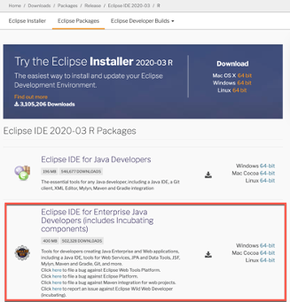
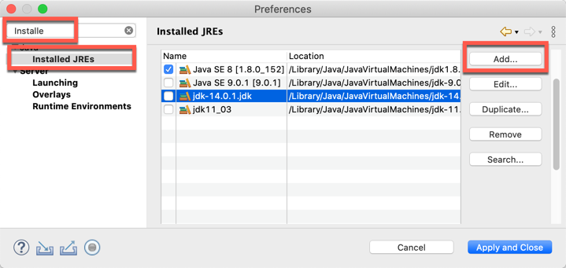
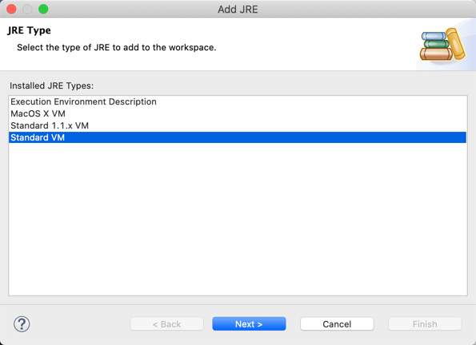
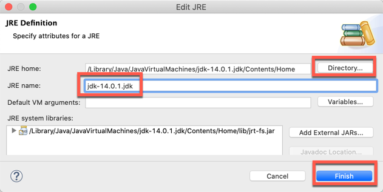
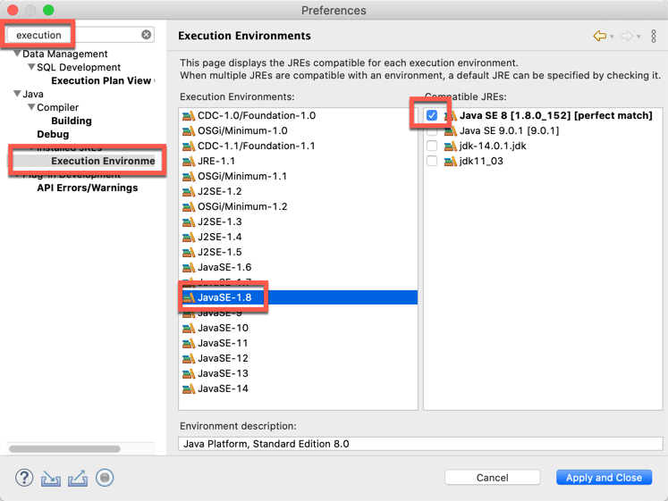
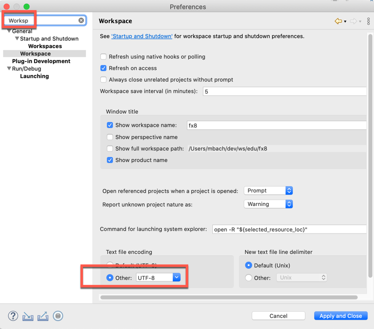
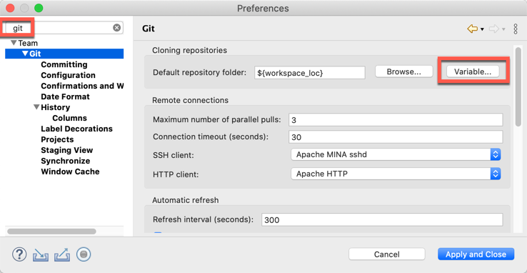
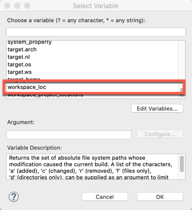
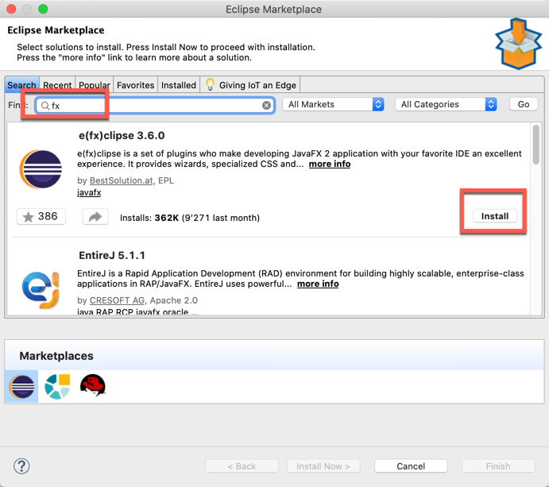
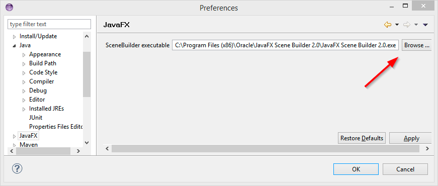

# Eclipse Configuration

| [Intro](../README.md)
| [1 Scene Builder](part1.md)
| [2 Model and TableView](part2.md)
| [3 Interacting](part3.md)
| [4 CSS Styling](part4.md)
| [5 Storing Data as XML](part5.md)
| [6 Statics Data](part6.md)
| [7 Deployment](part7.md)
|

We need to tell Eclipse to use the installed JDK's' and also where it will find the Scene Builder:

1. Update your eclipse to the current version by [downloading a new eclipse](https://www.eclipse.org/downloads/)
   or use menu _Help | Check For Updates_ for your existing installation.

&nbsp;&nbsp;&nbsp;&nbsp;&nbsp;&nbsp;

2. Open the Eclipse Preferences and navigate to Java | Installed JREs.
    _Windows:_ Menu->Windows->Preferences
    _MacOS:_ Menu->Eclipse->Preferences oder cmd ,

3. For JDK download use [Oracle](https://www.oracle.com/ch-de/java/technologies/javase-downloads.html) or [OpenJDK](https://adoptopenjdk.net/).

4. Click Add…, select Standard VM and choose the installation Directory of your JDK 8.

5. Remove the JRE's-8.

 

&nbsp;&nbsp;&nbsp;&nbsp;&nbsp;&nbsp;

 

Ad a standard VM.

&nbsp;&nbsp;&nbsp;&nbsp;&nbsp;&nbsp;

 

The latest version in March 2021 is _JDK16_.

- MacOS     /Library/Java/JavaVirtualMachines/jdk-16.jdk/Contents/Home
- Windows  C:\Programme\Java\ jdk-16.jdk

&nbsp;&nbsp;&nbsp;&nbsp;&nbsp;&nbsp;

 

Select for each _JavaSE_ the corresponding _JDK_.

&nbsp;&nbsp;&nbsp;&nbsp;&nbsp;&nbsp;

 

Make sure you are using UTF-8 encoding.

&nbsp;&nbsp;&nbsp;&nbsp;&nbsp;&nbsp;

 

Define the standard git directory to ${workspace_loc}:

&nbsp;&nbsp;&nbsp;&nbsp;&nbsp;&nbsp;

 

Define the variable:

&nbsp;&nbsp;&nbsp;&nbsp;&nbsp;&nbsp;

 

## Install JavaFx to Eclipse

You can find the javafx plugin through the eclipse marketplace (Menu->Help->Marketplace ).

&nbsp;&nbsp;&nbsp;&nbsp;&nbsp;&nbsp;

 

Navigate to the JavaFX preferences. Specify the path to your [Scene Builder](https://gluonhq.com/products/scene-builder/) executable.

&nbsp;&nbsp;&nbsp;&nbsp;&nbsp;&nbsp;
