# Part 1: Scene Builder

| [Intro](../README.md)
| [1 Scene Builder](part1.md)
| [2 Model and TableView](part2.md)
| [3 Interacting](part3.md)
| [4 CSS](part4.md)
| [5 XML](part5.md)
| [6 Statistics](part6.md)
| [7 Deployment](part7.md)
|

Derived from [_Java FX Address Book_](https://code.makery.ch/library/javafx-tutorial/) tutorial.

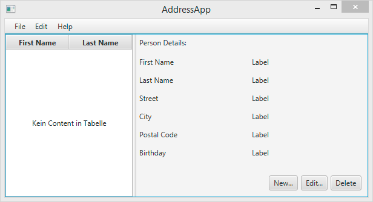

<br/>

## Topics in Part 1

- Getting to know JavaFX
- Creating and starting a _JavaFX_ Project
- Using _Scene Builder_ to design the user interface
- Basic application structure using the _Model-View-Controller (MVC)_ pattern

## Prerequisites

- Latest [Oracle](https://www.oracle.com/ch-de/java/technologies/javase-downloads.html) or [OpenJDK](https://adoptopenjdk.net/) (JDK11 onwards does **NOT** include JavaFX).
- An IDE like [IntelliJ](https://www.jetbrains.com/idea/download),
  [Visual Studio Code](https://code.visualstudio.com/?wt.mc_id=vscom_downloads),
  [Netbeans](https://netbeans.apache.org/download/index.html) or [Eclipse](https://www.eclipse.org/downloads/).

-  Configure your development tool stack based on
  [IntelliJ](https://github.com/mbachmann/java-development-environment-installation) or [Eclipse IDE](eclipse.md).

- [Scene Builder](https://gluonhq.com/products/scene-builder/)  (provided by Gluon).
- [Maven](https://maven.apache.org/install.html)

## Helpful Links

You might want to bookmark the following links:

- [Oracle Java Documentation](https://docs.oracle.com/en/java/index.html) for Java Platform, Standard Edition (Java SE)
- [Java 16 API](https://docs.oracle.com/en/java/javase/16/) for Java Platform, Standard Edition (Java SE)
- [Open Java FX](https://openjfx.io/) for Open Source Java FX
- [Getting Started with JavaFX](https://openjfx.io/openjfx-docs/) for Open Source Java FX
- [ControlsFX](https://controlsfx.github.io/javadoc/11.1.0/index.html) - ControlsFX project for additional JavaFX controls


The links to _Java 8_ with _Java FX 8_:

- [Java 8 API](https://docs.oracle.com/javase/8/docs/api/) - JavaDoc for the standard Java classes
- [Oracle JavaFX 8 API](https://docs.oracle.com/javase/8/javafx/api/) - JavaDoc for JavaFX classes
- [Oracle’s JavaFX Tutorials](https://docs.oracle.com/javase/8/javafx/get-started-tutorial/get_start_apps.htm) - Official JavaFX Tutorials by Oracle

Now, let’s get started!

##  Create a new JavaFX Project

This tutorial is based on Maven. It is using the [javafx plugin](https://github.com/openjfx/javafx-maven-plugin) from
[openjfx](https://openjfx.io/openjfx-docs/#maven). You can find a simple
Java FX project [here](https://github.com/openjfx/samples/tree/master/HelloFX/Maven/hellofx).

The [pom.xml](https://github.com/mbachmann/java-fx-address-book/blob/master/pom.xml) file used
 for this project has some additional dependencies installed:

- [javafx-controls](https://mvnrepository.com/artifact/org.controlsfx/controlsfx)
- [javafx-fxml](https://mvnrepository.com/artifact/org.openjfx/javafx-fxml)
- log4j-api and log4j-core
- gson
- junit-jupiter-api with junit-jupiter-engine, junit-vintage-engine and junit
- mockito-junit-jupiter with mockito-core and assertj-core

JDK-11 and later versions do not contain anymore _Java FX_ components. It means,
we need to include [javafx-controls](https://mvnrepository.com/artifact/org.controlsfx/controlsfx) and
[javafx-fxml](https://mvnrepository.com/artifact/org.openjfx/javafx-fxml) by using _Maven_.

The easiest way starting the _address book tutorial_ is by **forking** or _cloning_ this tutorial. Just copy the link
_https://github.com/mbachmann/java-fx-address-book_ in your IDE by using the functionality _New Project from Version Control_.

If you are using **IntelliJ**:

&nbsp;&nbsp;&nbsp;&nbsp;&nbsp;&nbsp;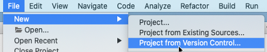

<br/>

or **Eclipse**:

&nbsp;&nbsp;&nbsp;&nbsp;&nbsp;&nbsp;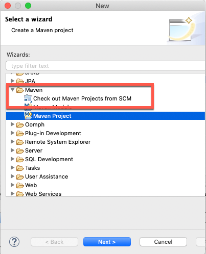

<br/>

The project consists of a `module-info.java` file and provides a modular java project.

```java
module ch.makery.address {
    requires javafx.controls;
    requires javafx.fxml;

    opens ch.makery.address to javafx.fxml;
    opens ch.makery.address.view to javafx.fxml;
    exports ch.makery.address;
}
```

## Create the Packages

Right from the start we will follow good software design principles.
One very important principle is that of
[Model-View-Controller (MVC)](https://en.wikipedia.org/wiki/Model%E2%80%93view%E2%80%93controller).
According to this we divide our code into three units and create a package
If you have cloned this repository the packages are already prepared. In
each package you will find a `.gitkeep` file. As soon as you have your own
files in a package, you can delete `.gitkeep`.

If you are working with your own new project use for each package in the src area  
(Right-click on the src-folder, New… | Package):

- `ch.makery.address` - contains most controller classes (=business logic)
- `ch.makery.address.model` - contains model classes

We are using Maven. Maven wants us to put the fxml view files to the `resources` folder.

- `ch.makery.address.view` - contains views

Note: Our view package will also contain some controllers that are directly related to a single view. Let’s call them view-controllers.

## Create the FXML Layout File

There are two ways to create the user interface.
Either using an XML file or programming everything in Java.
Looking around the internet you will encounter both. We will use XML (ending in .fxml) for most parts.
I find it a cleaner way to keep the controller and view separated from each other.
Further, we can use the graphical Scene Builder to edit our XML.
That means we will not have to directly work with XML.

Right-click on the view package `ch.makery.address.view` in the _resources area_ and create a new FXML Document called `PersonOverview`.

#### IntelliJ IDE

With the **IntelliJ** _IDE_ you do (Right-click on the resources-folder package
`ch.makery.address.view`, New… | fxml File):

&nbsp;&nbsp;&nbsp;&nbsp;&nbsp;&nbsp;

<br/>

#### Eclipse IDE

With **Eclipse** you do ...

&nbsp;&nbsp;&nbsp;&nbsp;&nbsp;&nbsp;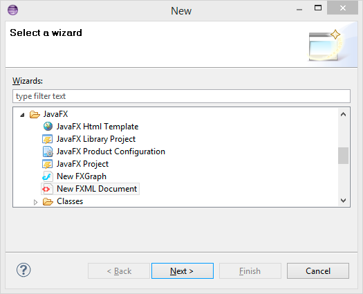

<br/>

You can configure the Root element to `AnchorPane`.

&nbsp;&nbsp;&nbsp;&nbsp;&nbsp;&nbsp;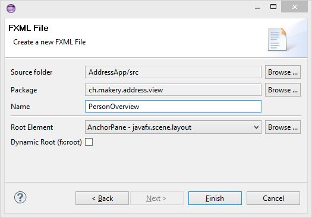

<br/>

The content of the generated file looks like:

```xml
<?xml version="1.0" encoding="UTF-8"?>

<?import java.lang.*?>
<?import java.util.*?>
<?import javafx.scene.*?>
<?import javafx.scene.control.*?>
<?import javafx.scene.layout.*?>

<AnchorPane xmlns="http://javafx.com/javafx"
            xmlns:fx="http://javafx.com/fxml"
            fx:controller="ch.makery.address.view.PersonOverview"
            prefHeight="400.0" prefWidth="600.0">

</AnchorPane>
```

##  Design with Scene Builder

```
Note: If you can't get it to work, download the source of this tutorial part and try it with the included `fxml`.
```

Right-click on `PersonOverview.fxml` and choose _Open with Scene Builder_.
Now you should see the Scene Builder with just an `AnchorPane` (visible under Hierarchy on the left).

(If Scene Builder does not open, go to Window | Preferences | JavaFX and set the correct path to your Scene Builder installation).

1. Select the _Anchor Pane_ in your Hierarchy and adjust the size under Layout (right side):

&nbsp;&nbsp;&nbsp;&nbsp;&nbsp;&nbsp;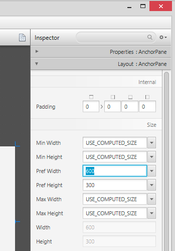

<br/>

2. Add a _Split Pane_ (Horizontal Flow) by dragging it from the Library into the main area.
   Right-click the _Split Pane_ in the Hierarchy view and select Fit to Parent.

&nbsp;&nbsp;&nbsp;&nbsp;&nbsp;&nbsp;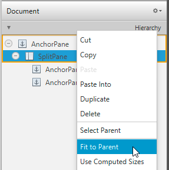

<br/>

3. Drag a _TableView_ (under Controls) into the left side of the _SplitPane_.
    Select the _TableView_ (not a Column) and set the following layout constraints to the _TableView_.
    Inside an _AnchorPane_ you can always set anchors to the four borders
    [more information on Layouts](https://docs.oracle.com/javase/8/javafx/layout-tutorial/builtin_layouts.htm).

&nbsp;&nbsp;&nbsp;&nbsp;&nbsp;&nbsp;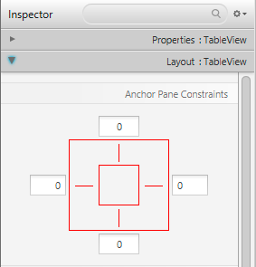

<br/>


4. Go to the menu _Preview_ | _Show Preview_ in Window to see, whether it behaves right. Try resizing the window.
   The TableView should resize together with the window as it is anchored to the borders.

5. Change the column text (under Properties) to "First Name" and "Last Name".

&nbsp;&nbsp;&nbsp;&nbsp;&nbsp;&nbsp;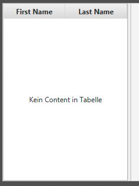

<br/>

6. Select the _TableView_ and choose constrained-resize for the Column Resize Policy (under Properties).
   This ensures that the colums will always take up all available space.

&nbsp;&nbsp;&nbsp;&nbsp;&nbsp;&nbsp;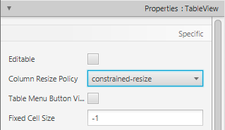

<br/>


7. Add a Label on the right side with the text "Person Details" (hint: use the search to find the Label).
   Adjust it’s layout using anchors.

&nbsp;&nbsp;&nbsp;&nbsp;&nbsp;&nbsp;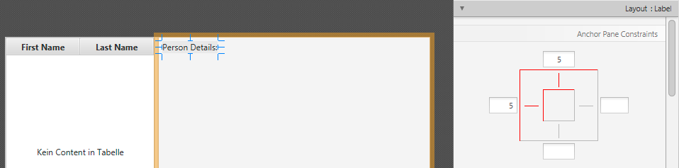

<br/>


8. Add a GridPane on the right side, select it and adjust its layout using anchors (top, right and left).

&nbsp;&nbsp;&nbsp;&nbsp;&nbsp;&nbsp;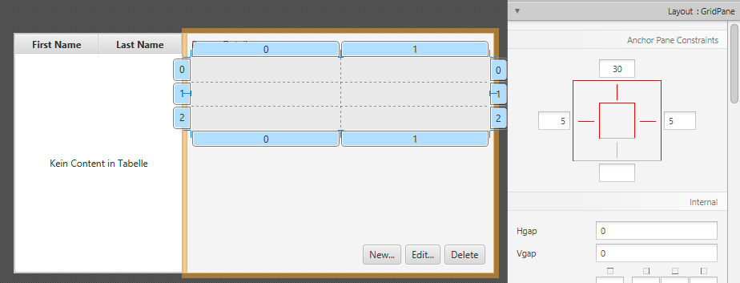

<br/>

9. Add the following labels to the cells. <br/>
   Note: To add a row to the _GridPane_ select an existing row number (will turn yellow),
   right-click the row number and choose "Add Row".

&nbsp;&nbsp;&nbsp;&nbsp;&nbsp;&nbsp;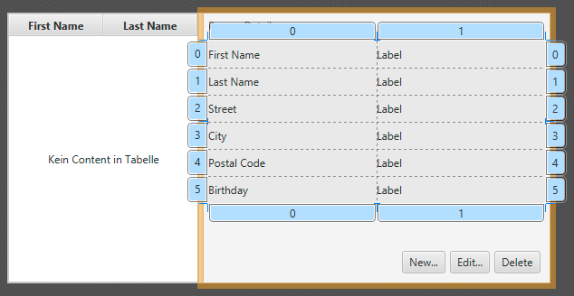

<br/>

10. Add a _ButtonBar_ at the bottom. Add three buttons to the bar.
    Now, set anchors (right and bottom) to the _ButtonBar_ so it stays in the right place.

&nbsp;&nbsp;&nbsp;&nbsp;&nbsp;&nbsp;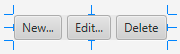

<br/>

11. Now you should see something like the following. Use the _Preview_ menu to test its resizing behaviour.

&nbsp;&nbsp;&nbsp;&nbsp;&nbsp;&nbsp;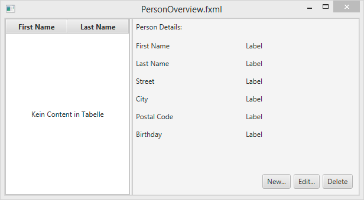

<br/>

## Create the Main Application

We need another FXML for our root layout which will contain a menu bar and wraps the
just created `PersonOverview.fxml`.

1. Create another _FXML Document_ inside the view package called `RootLayout.fxml`.
   This time, choose _BorderPane_ as the root element.

#### With IntelliJ

&nbsp;&nbsp;&nbsp;&nbsp;&nbsp;&nbsp;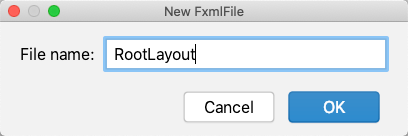

<br/>

Open the `RootLayout.fxml` file with the source editor and replace `AnchorPane` by `BorderPane`.

```xml
<?xml version="1.0" encoding="UTF-8"?>

<?import java.lang.*?>
<?import java.util.*?>
<?import javafx.scene.*?>
<?import javafx.scene.control.*?>
<?import javafx.scene.layout.*?>

<BorderPane xmlns="http://javafx.com/javafx"
            xmlns:fx="http://javafx.com/fxml"
            fx:controller="ch.makery.address.view.RootLayout"
            prefHeight="400.0" prefWidth="600.0">

</BorderPane>
```

#### With Eclipse

&nbsp;&nbsp;&nbsp;&nbsp;&nbsp;&nbsp;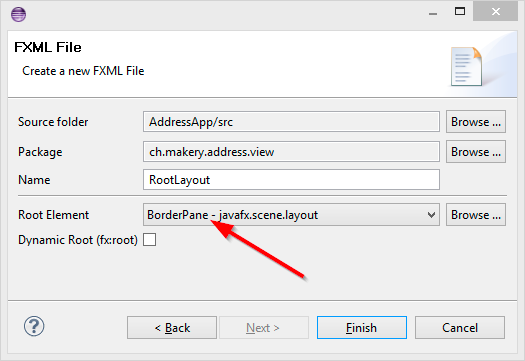

<br/>

2. Open the `RootLayout.fxml` in Scene Builder.


3. Resize the _BorderPane_ with _Pref Width_ set to 600 and _Pref Height_ set to 400.

&nbsp;&nbsp;&nbsp;&nbsp;&nbsp;&nbsp;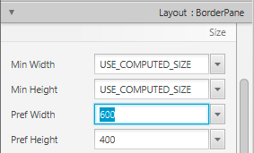

<br/>

4. Add a _MenuBar_ into the TOP Slot. We will not implement the menu functionality at the moment.

&nbsp;&nbsp;&nbsp;&nbsp;&nbsp;&nbsp;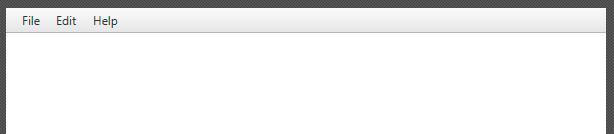

<br/>

## The JavaFX Main Class

Now, we need to create the main java class that starts up our application with the `RootLayout.fxml`
and adds the `PersonOverview.fxml` in the center.

#### IntelliJ

Right-click on your project and choose New _JavaFXApplication_. Use the name `MainApp`.

&nbsp;&nbsp;&nbsp;&nbsp;&nbsp;&nbsp;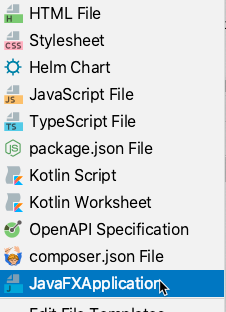

The generated code looks like:

```java
package ch.makery.address;

import javafx.application.Application;
import javafx.stage.Stage;

public class MainApp extends Application {

    public static void main(String[] args) {
        launch(args);
    }

    @Override
    public void start(Stage primaryStage) {

    }
}
```


#### Eclipse

Right-click on your project and choose _New | Other…_ and choose JavaFX Main Class.

&nbsp;&nbsp;&nbsp;&nbsp;&nbsp;&nbsp;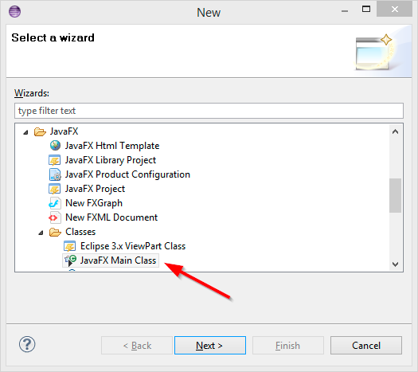

<br>

We’ll call the class MainApp and put it in the controller package 'ch.makery.address'
(note: this is the parent package of the view and model subpackages).


&nbsp;&nbsp;&nbsp;&nbsp;&nbsp;&nbsp;

<br>

The generated MainApp.java class extends from Application and contains two methods.
This is the basic structure that we need to start a JavaFX Application.

&nbsp;&nbsp;&nbsp;&nbsp;&nbsp;&nbsp;&nbsp;&nbsp;&nbsp;&nbsp;&nbsp;&nbsp;&nbsp;&nbsp;&nbsp;&nbsp;&nbsp;&nbsp;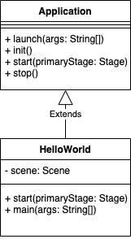

<br>

The most important part for us is the start(Stage primaryStage) method.
It is automatically called when the application is launched from within the main method.

As you see, the start(...) method receives a Stage as parameter.
The following graphic illustrates the structure of every JavaFX application:

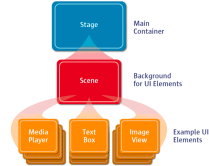

Image Source: [https://www.oracle.com](https://www.oracle.com)

<br/>

**It’s like a theater play**: The _Stage_ is the main container which
is usually a Window with a border and the typical minimize, maximize and close buttons.
Inside the _Stage_ you add a _Scene_ which can, of course, be switched out by another _Scene_.
Inside the Scene the actual JavaFX nodes like _AnchorPane_, _TextBox_, etc. are added.

For more information on this turn to [Working with the JavaFX Scene Graph](https://docs.oracle.com/javase/8/javafx/scene-graph-tutorial/scenegraph.htm).

-----

Open `MainApp.java` and replace the code with the following:

```java
import java.io.IOException;

import javafx.application.Application;
import javafx.fxml.FXMLLoader;
import javafx.scene.Scene;
import javafx.scene.layout.AnchorPane;
import javafx.scene.layout.BorderPane;
import javafx.stage.Stage;

public class MainApp extends Application {

    private Stage primaryStage;
    private BorderPane rootLayout;

    @Override
    public void start(Stage primaryStage) {
        this.primaryStage = primaryStage;
        this.primaryStage.setTitle("AddressApp");

        initRootLayout();

        showPersonOverview();
    }

    /**
     * Initializes the root layout.
     */
    public void initRootLayout() {
        try {
            // Load root layout from fxml file.
            FXMLLoader loader = new FXMLLoader();
            loader.setLocation(MainApp.class.getResource("view/RootLayout.fxml"));
            rootLayout = (BorderPane) loader.load();

            // Show the scene containing the root layout.
            Scene scene = new Scene(rootLayout);
            primaryStage.setScene(scene);
            primaryStage.show();
        } catch (IOException e) {
            e.printStackTrace();
        }
    }

    /**
     * Shows the person overview inside the root layout.
     */
    public void showPersonOverview() {
        try {
            // Load person overview.
            FXMLLoader loader = new FXMLLoader();
            loader.setLocation(MainApp.class.getResource("view/PersonOverview.fxml"));
            AnchorPane personOverview = (AnchorPane) loader.load();

            // Set person overview into the center of root layout.
            rootLayout.setCenter(personOverview);
        } catch (IOException e) {
            e.printStackTrace();
        }
    }

    /**
     * Returns the main stage.
     * @return
     */
    public Stage getPrimaryStage() {
        return primaryStage;
    }

    public static void main(String[] args) {
        System.setProperty("prism.lcdtext", "false");
        launch(args);
    }
}
```

The code consists beside the `main()` and the `start()` method of two methods loading the fxml resources.

- `initRootLayout()` loads the resource "view/RootLayout.fxml".
- `showPersonOverview()` loads the resource "view/PersonOverview.fxml"

The root layout contains a _BorderPane_. The _AnchorPane_ of `PersonOverview` is assigned to the `CenterPane`.

If you run the application now, you should see something like the screenshot at the beginning of this post.

## Frequent Problems

If JavaFX can’t find the `fxml` file you specified, you might get the following error message:

`java.lang.IllegalStateException: Location is not set`.

To solve this issue double check if you didn’t misspell the name of your `fxml` files!

```
If it still doesn't work, check out the branch `1_scene_builder` of this tutorial part and try it with the included fxml.
```

##  What's Next?

In [Tutorial Part 2](part2.md) we will add some data and functionality to our `AddressApp`.

