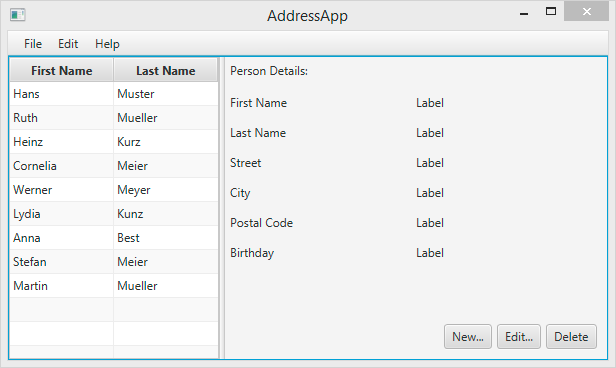
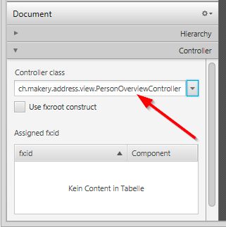
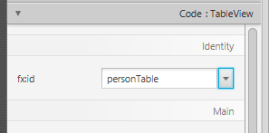
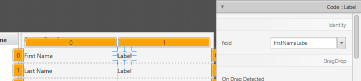

# Part 2: Model and TableView

| [Intro](../README.md)
| [1 Scene Builder](part1.md)
| [2 Model and TableView](part2.md)
| [3 Interacting](part3.md)
| [4 CSS](part4.md)
| [5 XML](part5.md)
| [6 Statistics](part6.md)
| [7 Deployment](part7.md)
|

Derived from [_Java FX Address Book_](https://code.makery.ch/library/javafx-tutorial/) tutorial.



<br/>

## Create the Model Class

We need a model class to hold information about the people in our address book.
Add a new class to the model package (`ch.makery.address.model`) called `Person`.
The `Person` class will have a few instance variables for the name, address and birthday.
Add the following code to the class. I’ll explain some JavaFX specifics after the code.

**Person.java**

```java
package ch.makery.address.model;

import java.time.LocalDate;

import javafx.beans.property.IntegerProperty;
import javafx.beans.property.ObjectProperty;
import javafx.beans.property.SimpleIntegerProperty;
import javafx.beans.property.SimpleObjectProperty;
import javafx.beans.property.SimpleStringProperty;
import javafx.beans.property.StringProperty;

/**
 * Model class for a Person.
 *
 * @author Marco Jakob
 */
public class Person {

	private final StringProperty firstName;
	private final StringProperty lastName;
	private final StringProperty street;
	private final IntegerProperty postalCode;
	private final StringProperty city;
	private final ObjectProperty<LocalDate> birthday;

	/**
	 * Default constructor.
	 */
	public Person() {
		this(null, null);
	}
	
	/**
	 * Constructor with some initial data.
	 * 
	 * @param firstName
	 * @param lastName
	 */
	public Person(String firstName, String lastName) {
		this.firstName = new SimpleStringProperty(firstName);
		this.lastName = new SimpleStringProperty(lastName);
		
		// Some initial dummy data, just for convenient testing.
		this.street = new SimpleStringProperty("some street");
		this.postalCode = new SimpleIntegerProperty(1234);
		this.city = new SimpleStringProperty("some city");
		this.birthday = new SimpleObjectProperty<LocalDate>(LocalDate.of(1999, 2, 21));
	}
	
	public String getFirstName() {
		return firstName.get();
	}

	public void setFirstName(String firstName) {
		this.firstName.set(firstName);
	}
	
	public StringProperty firstNameProperty() {
		return firstName;
	}

	public String getLastName() {
		return lastName.get();
	}

	public void setLastName(String lastName) {
		this.lastName.set(lastName);
	}
	
	public StringProperty lastNameProperty() {
		return lastName;
	}

	public String getStreet() {
		return street.get();
	}

	public void setStreet(String street) {
		this.street.set(street);
	}
	
	public StringProperty streetProperty() {
		return street;
	}

	public int getPostalCode() {
		return postalCode.get();
	}

	public void setPostalCode(int postalCode) {
		this.postalCode.set(postalCode);
	}
	
	public IntegerProperty postalCodeProperty() {
		return postalCode;
	}

	public String getCity() {
		return city.get();
	}

	public void setCity(String city) {
		this.city.set(city);
	}
	
	public StringProperty cityProperty() {
		return city;
	}

	public LocalDate getBirthday() {
		return birthday.get();
	}

	public void setBirthday(LocalDate birthday) {
		this.birthday.set(birthday);
	}
	
	public ObjectProperty<LocalDate> birthdayProperty() {
		return birthday;
	}
}
```

### Explanations

- With JavaFX it’s common to use `Properties` for all fields of a model class.
A `Property` allows us, for example, to automatically be notified when the `lastName` or any other variable is changed.
This helps us keep the view in sync with the data.
To learn more about `Properties` read
Using [JavaFX Properties and Binding](https://docs.oracle.com/javase/8/javafx/properties-binding-tutorial/binding.htm).

- `LocalDate`, the type we’re using for `birthday`, is part of the
new [Date and Time API for JDK 8](https://docs.oracle.com/javase/tutorial/datetime/iso/).


## A List of Persons

The main Data that our application manages, is a bunch of persons.
Let’s create a list for Person objects inside the `MainApp` class.
All other controller classes will later get access to that central list inside the `MainApp`.

### ObservableList

We are working with JavaFX view classes that need to be informed about any changes made to the
list of persons. This is important, since otherwise the view would not be in sync with the data.
For this purpose, JavaFX introduces some new [Collection classes](https://docs.oracle.com/javase/8/javafx/collections-tutorial/collections.htm).

From those collections, we need the `ObservableList`.
To create a new `ObservableList`, add the following code at the beginning of the `MainApp` class.
We’ll also add a constructor that creates some sample data and a public getter method:

**MainApp.java**

```java
    // ... AFTER THE OTHER VARIABLES ...

	/**
	 * The data as an observable list of Persons.
	 */
	private ObservableList<Person> personData = FXCollections.observableArrayList();

	/**
	 * Constructor
	 */
	public MainApp() {
		// Add some sample data
		personData.add(new Person("Hans", "Muster"));
		personData.add(new Person("Ruth", "Mueller"));
		personData.add(new Person("Heinz", "Kurz"));
		personData.add(new Person("Cornelia", "Meier"));
		personData.add(new Person("Werner", "Meyer"));
		personData.add(new Person("Lydia", "Kunz"));
		personData.add(new Person("Anna", "Best"));
		personData.add(new Person("Stefan", "Meier"));
		personData.add(new Person("Martin", "Mueller"));
	}
  
	/**
	 * Returns the data as an observable list of Persons. 
	 * @return
	 */
	public ObservableList<Person> getPersonData() {
		return personData;
	}
  
    // ... THE REST OF THE CLASS ...
```

## The PersonOverviewController

Now let’s finally get some data into our table. We’ll need a controller for our `PersonOverview.fxml`.

1. Create a normal class inside the view package called `PersonOverviewController.java`.
(We must put it in the same package as the `PersonOverview.fxml`, otherwise the SceneBuilder won’t find it.)
2. We’ll add some instance variables that give us access to the table and
the labels inside the view. The fields and some methods have a special `@FXML` annotation.
This is necessary for the fxml file to have access to private fields and private methods.
After we have everything set up in the fxml file, the application will automatically
fill the variables when the fxml file is loaded. So let’s add the following code:

**Note: Remember to always use the javafx imports, NOT awt or swing!**

***PersonOverviewController.java***

```java
package ch.makery.address.view;

import javafx.fxml.FXML;
import javafx.scene.control.Label;
import javafx.scene.control.TableColumn;
import javafx.scene.control.TableView;
import ch.makery.address.MainApp;
import ch.makery.address.model.Person;

public class PersonOverviewController {
    @FXML
    private TableView<Person> personTable;
    @FXML
    private TableColumn<Person, String> firstNameColumn;
    @FXML
    private TableColumn<Person, String> lastNameColumn;

    @FXML
    private Label firstNameLabel;
    @FXML
    private Label lastNameLabel;
    @FXML
    private Label streetLabel;
    @FXML
    private Label postalCodeLabel;
    @FXML
    private Label cityLabel;
    @FXML
    private Label birthdayLabel;

    // Reference to the main application.
    private MainApp mainApp;

    /**
     * The constructor.
     * The constructor is called before the initialize() method.
     */
    public PersonOverviewController() {
    }

    /**
     * Initializes the controller class. This method is automatically called
     * after the fxml file has been loaded.
     */
    @FXML
    private void initialize() {
    	// Initialize the person table with the two columns.
        firstNameColumn.setCellValueFactory(cellData -> cellData.getValue().firstNameProperty());
        lastNameColumn.setCellValueFactory(cellData -> cellData.getValue().lastNameProperty());
    }

    /**
     * Is called by the main application to give a reference back to itself.
     * 
     * @param mainApp
     */
    public void setMainApp(MainApp mainApp) {
        this.mainApp = mainApp;

        // Add observable list data to the table
        personTable.setItems(mainApp.getPersonData());
    }
}
```

Now this code will probably need some explaining:

- All fields and methods where the fxml file needs access must be annotated with `@FXML`.
Actually, only if they are private, but it’s better to have them private and mark them with the annotation!
- The `initialize()` method is automatically called after the fxml file has been loaded.
At this time, all the _FXML fields_ should have been initialized already.
- The `setCellValueFactory(...)` that we set on the table columns are used to determine
which field inside the `Person` objects should be used for the particular column.
The arrow -> indicates that we’re using a _Java 8_ feature called **Lambdas**.
(Another option would be to use a `PropertyValueFactory`, but this is not _type-safe_).


We're only using `StringProperty` values for our table columns in this example.
When you want to use `IntegerProperty` or `DoubleProperty`, the `setCellValueFactory(...)`
must have an additional `asObject()`:

```java
myIntegerColumn.setCellValueFactory(cellData ->
      cellData.getValue().myIntegerProperty().asObject());
```

This is necessary because of a bad design decision of JavaFX (see this discussion).

### Connecting MainApp with the PersonOverviewController

The `setMainApp(...)` method must be called by the `MainApp` class.
This gives us a way to access the `MainApp` object and get the list of Persons and other things.
Replace the `showPersonOverview()` method with the following. It contains two additional lines:

**MainApp.java - new showPersonOverview() method**

```java
/**
 * Shows the person overview inside the root layout.
 */
public void showPersonOverview() {
    try {
        // Load person overview.
        FXMLLoader loader = new FXMLLoader();
        loader.setLocation(MainApp.class.getResource("view/PersonOverview.fxml"));
        AnchorPane personOverview = (AnchorPane) loader.load();

        // Set person overview into the center of root layout.
        rootLayout.setCenter(personOverview);

        // Give the controller access to the main app.
        PersonOverviewController controller = loader.getController();
        controller.setMainApp(this);

    } catch (IOException e) {
        e.printStackTrace();
    }
}
```

##  Hook the View to the Controller

We’re almost there! But one little thing is missing: We haven’t told our
`PersonOverview.fxml` file yet, which controller to use and which element should
match to which field inside the controller.

1. Open `PersonOverview.fxml` with the SceneBuilder.

2. Open the Controller group on the left side and select the `PersonOverviewController` as controller class.

&nbsp;&nbsp;&nbsp;&nbsp;&nbsp;&nbsp;

<br/>

3. Select the `TableView` in the Hierarchy group and choose in the Code group the `personTable` field as **fx:id**.

&nbsp;&nbsp;&nbsp;&nbsp;&nbsp;&nbsp;

<br/>

4. Do the same for the columns and select `firstNameColumn` and `lastNameColumn` as **fx:id** respectively.

5. For **each label** in the second column, choose the corresponding **fx:id**.



<br/>

**Important**: Go back to your _IDE_ and **refresh the entire AddressApp** project (F5).
This is necessary because the _IDE_ sometimes doesn’t know about changes that were made inside the Scene Builder.


## Start the Application

When you start your application now, you should see something like the screenshot at the beginning of this blog post.

Congratulations!

_Note: The labels will not update when a person is selected, yet_. We will program user interactions in the next part of the tutorial.

## What's Next?

In Tutorial [Part 3](part3.md) we will add more functionality like adding, deleting and editing Persons.
