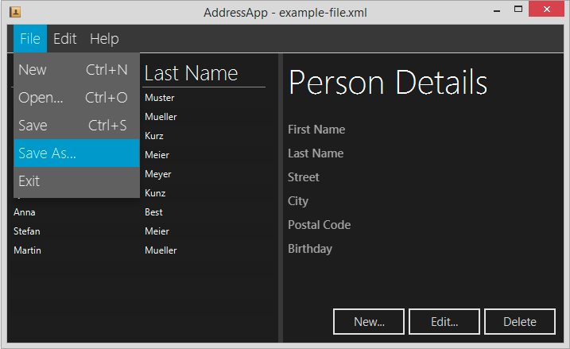
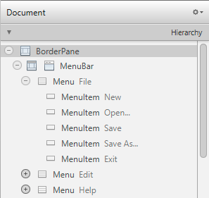

# Part 5: Storing Data as XML

| [Intro](../README.md)
| [1 Scene Builder](part1.md)
| [2 Model and TableView](part2.md)
| [3 Interacting](part3.md)
| [4 CSS](part4.md)
| [5 XML](part5.md)
| [6 Statistics](part6.md)
| [7 Deployment](part7.md)
|

Derived from [_Java FX Address Book_](https://code.makery.ch/library/javafx-tutorial/) tutorial.



<br/>

## Topics in Part 5

- [Saving the last opened file path in user preferences](#saving-user-preferences)
- [Persisting data as XML](#persisting-data-as-xml)
- [Reading and Writing Data with JAXB](#reading-and-writing-data-with-jaxb)
- [Using the JavaFX FileChooser](#filechooser)
- [Using the JavaFX Menu](#handling-menu-actions)


At the moment our address application’s data only resides in memory.
Every time we close the application, the data is lost. So it’s about time to
start thinking about persistently storing data.


### Saving User Preferences

Java allows us to save some application state using a class called `Preferences`.
Depending on the operating system, the `Preferences` are saved in different places
(e.g. the registry file in Windows).

We won’t be able to use `Preferences` to store our entire address book.
But it allows us to save some simple application state.
One such thing is the path to the last opened file. With this information we could load
the last application state whenever the user restarts the application.

The following two methods take care of saving and retrieving `Preferences`.
Add them to the end of your `MainApp` class:


**MainApp.java**

```java
    /**
     * Returns the person file preference, i.e. the file that was last opened.
     * The preference is read from the OS specific registry. If no such
     * preference can be found, null is returned.
     *
     * @return the last opened file
     */
    public File getPersonFilePath() {
        Preferences prefs = Preferences.userNodeForPackage(MainApp.class);
        String filePath = prefs.get("filePath", null);
        if (filePath != null) {
            return new File(filePath);
        } else {
            return null;
        }
    }

    /**
     * Sets the file path of the currently loaded file. The path is persisted in
     * the OS specific registry.
     *
     * @param file the file or null to remove the path
     */
    public void setPersonFilePath(File file) {
        Preferences prefs = Preferences.userNodeForPackage(MainApp.class);
        if (file != null) {
            prefs.put("filePath", file.getPath());

            // Update the stage title.
            primaryStage.setTitle("AddressApp - " + file.getName());
        } else {
            prefs.remove("filePath");

            // Update the stage title.
            primaryStage.setTitle("AddressApp");
        }
    }

```

We must add a line to the `module-info.java` file to require the `java.prefs` module.

**module-info.java**

```java
module ch.makery.address {
...
    requires java.prefs;
... 
}
```


## Persisting Data as XML

### Why XML?

One of the most common ways to persist data is using a database.
Databases usually contain some kind of relational data (like tables) while the data we need
to save are objects. This is called the [object-relational impedance mismatch](https://en.wikipedia.org/wiki/Object%E2%80%93relational_impedance_mismatch).
It is quite some work to match objects to relational database tables.
There are some frameworks that help with the matching (e.g. [Hibernate](http://hibernate.org/),
the most popular one) but it still requires quite some work to set up.

For our simple data model it’s much easier to use XML.
We’ll use a library called [JAXB](https://github.com/eclipse-ee4j/jaxb-ri)
(Java Architecture for XML Binding).
With just a few lines of code JAXB will allow us to generate XML output like this:

**Example xml output**

```xml
<persons>
    <person>
        <birthday>1999-02-21</birthday>
        <city>some city</city>
        <firstName>Hans</firstName>
        <lastName>Muster</lastName>
        <postalCode>1234</postalCode>
        <street>some street</street>
    </person>
    <person>
        <birthday>1999-02-21</birthday>
        <city>some city</city>
        <firstName>Anna</firstName>
        <lastName>Best</lastName>
        <postalCode>1234</postalCode>
        <street>some street</street>
    </person>
</persons>
```

## Using JAXB

_JAXB_ was included in the _JDK_ up to the version _JDK-10_. That means we need to include **additional libraries**
because we are using **JDK-16**:

**pom.xml**

```xml
      <!-- API -->
      <dependency>
         <groupId>jakarta.xml.bind</groupId>
         <artifactId>jakarta.xml.bind-api</artifactId>
         <version>2.3.3</version>
      </dependency>
      <!-- runtime -->
      <dependency>
         <groupId>org.glassfish.jaxb</groupId>
         <artifactId>jaxb-runtime</artifactId>
         <version>2.3.3</version>
         <scope>runtime</scope>
         <exclusions>
            <exclusion>
               <groupId>com.sun.activation</groupId>
               <artifactId>jakarta.activation</artifactId>
            </exclusion>
         </exclusions>
      </dependency>
```

We must require the `java.xml.bind` and the open `model` package to access through reflection.
The `model`and `util` package must be exported to allow access.

**module-info.java**

```java
module ch.makery.address {
    requires javafx.controls;
    requires javafx.fxml;
    requires java.prefs;
    requires java.xml.bind;

    opens ch.makery.address to javafx.fxml;
    opens ch.makery.address.view to javafx.fxml;
    opens ch.makery.address.model to java.xml.bind;
    exports ch.makery.address;
    exports ch.makery.address.model;
    exports ch.makery.address.util;
}
```

**JAXB** provides two main features: the ability to **marshal** Java objects into _XML_
and to **unmarshal** XML back into _Java objects_.

For _JAXB_ to be able to do the conversion, we need to prepare our _model_.

###  Preparing the Model Class for JAXB

Our data that we want to save resides in the `personData` variable inside our `MainApp` class.
_JAXB_ requires the top most class to be annotated with `@XmlRootElement`.
`personData` is of class `ObservableList` and we can’t put any annotations to `ObservableList`.
So we need to create another class that is only used to hold our list of `Persons` for saving to _XML_.

The new class we create is called `PersonListWrapper` and is put into the `ch.makery.address.model` package.

**PersonListWrapper.java**

```java
package ch.makery.address.model;

import java.util.List;

import javax.xml.bind.annotation.XmlElement;
import javax.xml.bind.annotation.XmlRootElement;

/**
 * Helper class to wrap a list of persons. This is used for saving the
 * list of persons to XML.
 * 
 * @author Marco Jakob
 */
@XmlRootElement(name = "persons")
public class PersonListWrapper {

    private List<Person> persons;

    @XmlElement(name = "person")
    public List<Person> getPersons() {
        return persons;
    }

    public void setPersons(List<Person> persons) {
        this.persons = persons;
    }
}
```

Notice the two annotations:

- `@XmlRootElement` defines the name of the root element.
- `@XmlElement` is an optional name we can specify for the element.

### Reading and Writing Data with JAXB

We’ll make our `MainApp` class responsible for reading and writing the person data.
Add the following two methods to the end of `MainApp.java`:

```java
    /**
     * Loads person data from the specified file. The current person data will
     * be replaced.
     *
     * @param file the file to load
     */
    public void loadPersonDataFromFile(File file) {
        try {
            JAXBContext context = JAXBContext
                    .newInstance(PersonListWrapper.class);
            Unmarshaller um = context.createUnmarshaller();

            // Reading XML from the file and unmarshalling.
            PersonListWrapper wrapper = (PersonListWrapper) um.unmarshal(file);

            personData.clear();
            personData.addAll(wrapper.getPersons());

            // Save the file path to the registry.
            setPersonFilePath(file);

        } catch (Exception e) { // catches ANY exception
            Alert alert = new Alert(Alert.AlertType.ERROR);
            alert.setTitle("Error");
            alert.setHeaderText("Could not load data");
            alert.setContentText("Could not load data from file:\n" + file.getPath());

            alert.showAndWait();
        }
    }

    /**
     * Saves the current person data to the specified file.
     *
     * @param file the file to save
     */
    public void savePersonDataToFile(File file) {
        try {
            JAXBContext context = JAXBContext
                    .newInstance(PersonListWrapper.class);
            Marshaller m = context.createMarshaller();
            m.setProperty(Marshaller.JAXB_FORMATTED_OUTPUT, true);

            // Wrapping our person data.
            PersonListWrapper wrapper = new PersonListWrapper();
            wrapper.setPersons(personData);

            // Marshalling and saving XML to the file.
            m.marshal(wrapper, file);

            // Save the file path to the registry.
            setPersonFilePath(file);
        } catch (Exception e) { // catches ANY exception
            Alert alert = new Alert(Alert.AlertType.ERROR);
            alert.setTitle("Error");
            alert.setHeaderText("Could not save data");
            alert.setContentText("Could not save data to file:\n" + file.getPath());

            alert.showAndWait();
        }
    }

```
In order to save the `birthday` date correctly we need to convert the `LocalDate` to XML.
We must provide a custom `LocalDateAdapter` to define this conversion.

Create a new class inside `ch.makery.address.util` called `LocalDateAdapter` with the following content:

**LocalDateAdapter.java**

```java
package ch.makery.address.util;

import java.time.LocalDate;

import javax.xml.bind.annotation.adapters.XmlAdapter;

/**
 * Adapter (for JAXB) to convert between the LocalDate and the ISO 8601 
 * String representation of the date such as '2012-12-03'.
 * 
 * @author Marco Jakob
 */
public class LocalDateAdapter extends XmlAdapter<String, LocalDate> {

    @Override
    public LocalDate unmarshal(String v) throws Exception {
        return LocalDate.parse(v);
    }

    @Override
    public String marshal(LocalDate v) throws Exception {
        return v.toString();
    }
}

```

Then open `Person.java` and add the following annotation to the `getBirthday()` method:

```java
    @XmlJavaTypeAdapter(LocalDateAdapter.class)
    public LocalDate getBirthday() {
        return birthday.get();
    }
```

The marshalling/unmarshalling is ready. Let’s create the save/load menu to actually be able to use it.

### Handling Menu Actions

In our `RootLayout.fxml` there is already a menu, but we haven’t used it yet.
Before we add action to the menu we’ll first create all menu items.

Open the `RootLayout.fxml` file in Scene Builder and drag the necessary menu items from
the library group to the `MenuBar` bar in the _hierarchy_ group.
Create a **New, Open…, Save, Save As…**, and **Exit** menu item.



<br/>

Hint: Using the _Accelerator_ setting under the _Properties_ group you can set shortcut keys to menu items.

## The RootLayoutController

For handling menu actions we’ll need a new controller class.
Create a class `RootLayoutController` inside the controller package `ch.makery.address.view`.

Add the following content to the controller:

**RootLayoutController.java**

```java
package ch.makery.address.view;

import java.io.File;

import javafx.fxml.FXML;
import javafx.scene.control.Alert;
import javafx.scene.control.Alert.AlertType;
import javafx.stage.FileChooser;
import ch.makery.address.MainApp;

/**
 * The controller for the root layout. The root layout provides the basic
 * application layout containing a menu bar and space where other JavaFX
 * elements can be placed.
 * 
 * @author Marco Jakob
 */
public class RootLayoutController {

    // Reference to the main application
    private MainApp mainApp;

    /**
     * Is called by the main application to give a reference back to itself.
     * 
     * @param mainApp
     */
    public void setMainApp(MainApp mainApp) {
        this.mainApp = mainApp;
    }

    /**
     * Creates an empty address book.
     */
    @FXML
    private void handleNew() {
        mainApp.getPersonData().clear();
        mainApp.setPersonFilePath(null);
    }

    /**
     * Opens a FileChooser to let the user select an address book to load.
     */
    @FXML
    private void handleOpen() {
        FileChooser fileChooser = new FileChooser();

        // Set extension filter
        FileChooser.ExtensionFilter extFilter = new FileChooser.ExtensionFilter(
                "XML files (*.xml)", "*.xml");
        fileChooser.getExtensionFilters().add(extFilter);

        // Show save file dialog
        File file = fileChooser.showOpenDialog(mainApp.getPrimaryStage());

        if (file != null) {
            mainApp.loadPersonDataFromFile(file);
        }
    }

    /**
     * Saves the file to the person file that is currently open. If there is no
     * open file, the "save as" dialog is shown.
     */
    @FXML
    private void handleSave() {
        File personFile = mainApp.getPersonFilePath();
        if (personFile != null) {
            mainApp.savePersonDataToFile(personFile);
        } else {
            handleSaveAs();
        }
    }

    /**
     * Opens a FileChooser to let the user select a file to save to.
     */
    @FXML
    private void handleSaveAs() {
        FileChooser fileChooser = new FileChooser();

        // Set extension filter
        FileChooser.ExtensionFilter extFilter = new FileChooser.ExtensionFilter(
                "XML files (*.xml)", "*.xml");
        fileChooser.getExtensionFilters().add(extFilter);

        // Show save file dialog
        File file = fileChooser.showSaveDialog(mainApp.getPrimaryStage());

        if (file != null) {
            // Make sure it has the correct extension
            if (!file.getPath().endsWith(".xml")) {
                file = new File(file.getPath() + ".xml");
            }
            mainApp.savePersonDataToFile(file);
        }
    }

    /**
     * Opens an about dialog.
     */
    @FXML
    private void handleAbout() {
    	Alert alert = new Alert(AlertType.INFORMATION);
    	alert.setTitle("AddressApp");
    	alert.setHeaderText("About");
    	alert.setContentText("Author: Marco Jakob\nWebsite: http://code.makery.ch");

    	alert.showAndWait();
    }

    /**
     * Closes the application.
     */
    @FXML
    private void handleExit() {
        System.exit(0);
    }
}
```

### FileChooser

Take note of the methods that use the `FileChooser` class inside `RootLayoutController` above.
First, a new object of the class `FileChooser` is created.
Then, an extension filter is added so that only files ending in `.xml` are displayed.
Finally, the file chooser is displayed on top of the _primary stage_.

If the user closes the dialog without choosing a file, `null` is returned.
Otherwise, we get the selected file, and we can pass it to the `loadPersonDataFromFile(...)`
 or `savePersonDataToFile(...)` method of `MainApp`.

### Connecting the fxml View to the Controller

1. Open `RootLayout.fxml` in Scene Builder. In the _Controller_ group select the
`RootLayoutController` as _Controller_ class.

2. Go back to the _Hierarchy_ group and select a menu item.
In the Code group under On Action you should see a choice of all the available controller methods.
Choose the corresponding method for each menu item.

&nbsp;&nbsp;&nbsp;&nbsp;&nbsp;&nbsp;

<br/>

3. Repeat the steps for every menu item.

4. Close Scene Builder and hit Refresh **(F5)** on your project’s root folder.
This will make the _IDE_ aware of the changes you made in Scene Builder.


## Connecting the MainApp and RootLayoutController

In several places, the `RootLayoutController` needs a reference back to the `MainApp`.
We haven’t passed the reference to the `RootLayoutController` yet.

Open the `MainApp` class and replace the `initRootLayout()` method with the following code:

```java
    /**
     * Initializes the root layout.
     */
    public void initRootLayout() {
        try {
            // Load root layout from fxml file.
            FXMLLoader loader = new FXMLLoader();
            loader.setLocation(MainApp.class.getResource("view/RootLayout.fxml"));
            rootLayout = (BorderPane) loader.load();

            // Show the scene containing the root layout.
            Scene scene = new Scene(rootLayout);
            if (cssName != null && !cssName.isEmpty()) {
                scene.getStylesheets().add(getClass().getResource(cssName).toExternalForm());
            }

            // Give the controller access to the main app.
            RootLayoutController controller = loader.getController();
            controller.setMainApp(this);

            primaryStage.setScene(scene);
            primaryStage.show();
        } catch (IOException e) {
            e.printStackTrace();
        }

        // Try to load last opened person file.
        File file = getPersonFilePath();
        if (file != null) {
            loadPersonDataFromFile(file);
        }
    }

```

Notice the two changes: The lines that give the controller access to the main app and the last three
lines to load the last opened person file.

## What's Next?

In Tutorial [Part 6](part6.md) we’ll add a birthday statistics chart.

