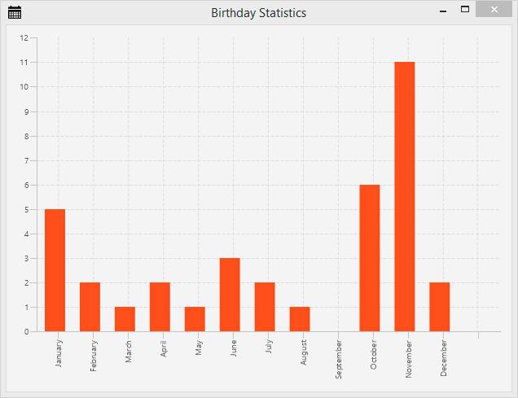
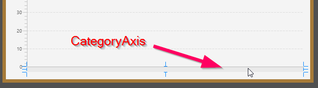
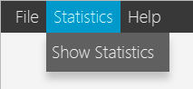
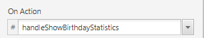

# Part 6: Statics Data

| [Intro](../README.md)
| [1 Scene Builder](part1.md)
| [2 Model and TableView](part2.md)
| [3 Interacting](part3.md)
| [4 CSS](part4.md)
| [5 XML](part5.md)
| [6 Statistics](part6.md)
| [7 Deployment](part7.md)
|

Derived from [_Java FX Address Book_](https://code.makery.ch/library/javafx-tutorial/) tutorial.



<br/>

## Topics in Part 6

- Creating a Statistics Chart to display birthday distribution.

## Birthday Statistics

All our people in the _AddressApp_ have a birthday. Wouldn’t it be nice to have some statistics
about when our people celebrate their birthday.

We’ll use a **Bar Chart** containing a bar for each month.
Each bar shows how many people have their birthday in that particular month.

## The Statistics FXML View

1. We start by creating a `BirthdayStatistics.fxml` file inside our `ch.makery.address.view` package.

2. Open the `BirthdayStatistics.fxml` file in Scene Builder.

3. Select the root `AnchorPane`. In the Layout group set the _Pref Width_ to 720 and the _Pref Height_ to 450.

4. Add a `BarChart` to the `AnchorPane`.

5. Right-click on the `BarChart` and select _Fit to Parent_.

6. Save the fxml file, go to the _IDE_ and refresh the project.

Before we’ll come back to Scene Builder we’ll first create the controller
and wire everything up in our `MainApp`.

##  The Statistics Controller


In the view package `ch.makery.address.view` create a Java class called `BirthdayStatisticsController.java`.

Let’s first take a look at the entire controller class before I start explaining:

**BirthdayStatisticsController.java**

```java
package ch.makery.address.view;

import java.text.DateFormatSymbols;
import java.util.Arrays;
import java.util.List;
import java.util.Locale;

import javafx.collections.FXCollections;
import javafx.collections.ObservableList;
import javafx.fxml.FXML;
import javafx.scene.chart.BarChart;
import javafx.scene.chart.CategoryAxis;
import javafx.scene.chart.XYChart;
import ch.makery.address.model.Person;

/**
 * The controller for the birthday statistics view.
 * 
 * @author Marco Jakob
 */
public class BirthdayStatisticsController {

    @FXML
    private BarChart<String, Integer> barChart;

    @FXML
    private CategoryAxis xAxis;

    private ObservableList<String> monthNames = FXCollections.observableArrayList();

    /**
     * Initializes the controller class. This method is automatically called
     * after the fxml file has been loaded.
     */
    @FXML
    private void initialize() {
        // Get an array with the English month names.
        String[] months = DateFormatSymbols.getInstance(Locale.ENGLISH).getMonths();
        // Convert it to a list and add it to our ObservableList of months.
        monthNames.addAll(Arrays.asList(months));

        // Assign the month names as categories for the horizontal axis.
        xAxis.setCategories(monthNames);
    }

    /**
     * Sets the persons to show the statistics for.
     * 
     * @param persons
     */
    public void setPersonData(List<Person> persons) {
        // Count the number of people having their birthday in a specific month.
        int[] monthCounter = new int[12];
        for (Person p : persons) {
            int month = p.getBirthday().getMonthValue() - 1;
            monthCounter[month]++;
        }

        XYChart.Series<String, Integer> series = new XYChart.Series<>();

        // Create a XYChart.Data object for each month. Add it to the series.
        for (int i = 0; i < monthCounter.length; i++) {
            series.getData().add(new XYChart.Data<>(monthNames.get(i), monthCounter[i]));
        }

        barChart.getData().add(series);
    }
}
```

### How the Controller Works

1. The controller will need access to two elements from our FXML file:
- The `barChart`: It has the type `String` and `Integer`.
The `String` is used for the month on the _x-axis_ and the `Integer` is used
for the number of people in a specific month.
- The `xAxis`: We’ll use this to add the month Strings.

2. The `initialize()` method fills the x-axis with a list of all the months.

3. The `setPersonData(...)` method will be accessed by the `MainApp` class to set the person data.
It loops through all persons and counts the birthdays per month.
Then it adds `XYChart.Data` for every month to the data series.
Each `XYChart.Data` object will represent one bar in the chart.


### Connecting View and Controller

1. Open `BirthdayStatistics.fxml` in Scene Builder.

2. In the _Controller_ group set `BirthdayStatisticsController` as controller.

3. Select the `BarChart` and choose `barChart` as `fx:id` Property (in the _Code_ group).

4. Select the `CategoryAxis` and choose `xAxis` as `fx:id` Property.

&nbsp;&nbsp;&nbsp;&nbsp;&nbsp;&nbsp;

<br/>

5. You may add a title to the `BarChart` (in _Properties_ group) for further styling.

## Connecting the View/Controller with MainApp

We’ll use the same mechanism for our _birthday statistics_ that we used for
the edit person dialog, a simple popup dialog.

Add the following method to your `MainApp` class:

```java
/**
 * Opens a dialog to show birthday statistics.
 */
public void showBirthdayStatistics() {
    try {
        // Load the fxml file and create a new stage for the popup.
        FXMLLoader loader = new FXMLLoader();
        loader.setLocation(MainApp.class.getResource("view/BirthdayStatistics.fxml"));
        AnchorPane page = (AnchorPane) loader.load();
        Stage dialogStage = new Stage();
        dialogStage.setTitle("Birthday Statistics");
        dialogStage.initModality(Modality.WINDOW_MODAL);
        dialogStage.initOwner(primaryStage);
        Scene scene = new Scene(page);
        dialogStage.setScene(scene);

        // Set the persons into the controller.
        BirthdayStatisticsController controller = loader.getController();
        controller.setPersonData(personData);

        dialogStage.show();

    } catch (IOException e) {
        e.printStackTrace();
    }
}

```

Everything is set up, but we don’t have anything that actually
calls the new showBirthdayStatistics() method.
Luckily we already have a menu in `RootLayout.fxml` that can be used for this purpose.

## Show Birthday Statistics Menu

In your `RootLayoutController` add the following method which will handle
user clicks on the show _birthday statistics_ menu item:

```java
/**
 * Opens the birthday statistics.
 */
@FXML
private void handleShowBirthdayStatistics() {
  mainApp.showBirthdayStatistics();
}
```

Now, open the `RootLayout.fxml` file with Scene Builder.
Create the _Statistics_ `Menu` with a _Show Statistics_ `MenuItem`:

&nbsp;&nbsp;&nbsp;&nbsp;&nbsp;&nbsp;

<br/>

Select the Show Statistics `MenuItem` and choose
`handleShowBirthdayStatistics` for `On Action` (in _Code_ group)

&nbsp;&nbsp;&nbsp;&nbsp;&nbsp;&nbsp;

<br/>

Go back to the _IDE_, refresh the project and **test it**.

More Information on JavaFX Charts

A good place for more information is the official Oracle tutorial
on [Working with JavaFX Charts](https://docs.oracle.com/javase/8/javafx/user-interface-tutorial/charts.htm).

## What's Next?

In the last tutorial [Part 7](part7.md) we will finally deploy our application
(i.e. package and deliver the app to our users).
