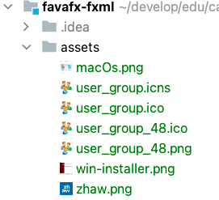
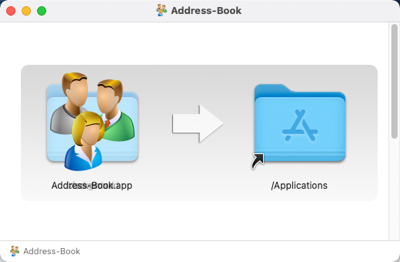
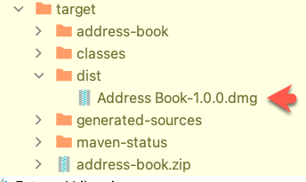

# Part 7: Deployment

| [Intro](../README.md)
| [1 Scene Builder](part1.md)
| [2 Model and TableView](part2.md)
| [3 Interacting](part3.md)
| [4 CSS](part4.md)
| [5 XML](part5.md)
| [6 Statistics](part6.md)
| [7 Deployment](part7.md)
|

Derived from [_Java FX Address Book_](https://code.makery.ch/library/javafx-tutorial/) tutorial.

## Resources

JPackage

- [https://docs.oracle.com/en/java/javase/17/jpackage/packaging-tool-user-guide.pdf](https://docs.oracle.com/en/java/javase/17/jpackage/packaging-tool-user-guide.pdf)
- [https://docs.oracle.com/en/java/javase/14/docs/specs/man/jpackage.html](https://docs.oracle.com/en/java/javase/14/docs/specs/man/jpackage.html)
- [https://openjdk.java.net/jeps/343](https://openjdk.java.net/jeps/343)

JPackage Maven Plugin

- [https://github.com/petr-panteleyev/jpackage-maven-plugin](https://github.com/petr-panteleyev/jpackage-maven-plugin)
- [https://github.panteleyev.org/jpackage-maven-plugin/](https://github.panteleyev.org/jpackage-maven-plugin/)

Linux Categories

- [https://specifications.freedesktop.org/menu-spec/latest/apa.html](https://specifications.freedesktop.org/menu-spec/latest/apa.html)

JPackage Gradle Plugin

- [https://plugins.gradle.org/plugin/org.panteleyev.jpackageplugin](https://plugins.gradle.org/plugin/org.panteleyev.jpackageplugin)
- [https://github.com/petr-panteleyev/jpackage-gradle-plugin ](https://github.com/petr-panteleyev/jpackage-gradle-plugin )


## Change the JLink Plugin configuration

Replace the content of the  _javafx-maven-plugin_ in the _pom.xml_ file:


```xml
         <plugin>
   <groupId>org.openjfx</groupId>
   <artifactId>javafx-maven-plugin</artifactId>
   <version>0.0.8</version>
   <executions>
      <execution>
         <!-- Default configuration for running with: mvn clean javafx:run -->
         <id>default-cli</id>
         <configuration>
            <mainClass>ch.makery.address/ch.makery.address.MainApp</mainClass>
            <launcher>address-book</launcher>

            <jlinkZipName>address-book</jlinkZipName>
            <jlinkImageName>address-book</jlinkImageName>
            <noManPages>true</noManPages>
            <stripDebug>true</stripDebug>
            <noHeaderFiles>true</noHeaderFiles>
         </configuration>
      </execution>
   </executions>
</plugin>
```

## Change the JAXB runtime

Replace the content of the _jaxb-runtime_ in the _pom.xml_ file from ...

```xml
<dependency>
   <groupId>org.glassfish.jaxb</groupId>
   <artifactId>jaxb-runtime</artifactId>
   <version>2.3.3</version>
   <scope>runtime</scope>
   <exclusions>
      <exclusion>
         <groupId>com.sun.activation</groupId>
         <artifactId>jakarta.activation</artifactId>
      </exclusion>
   </exclusions>
</dependency>

```

... to:

```xml
<dependency>
   <groupId>org.glassfish.jaxb</groupId>
   <artifactId>jaxb-runtime</artifactId>
   <version>2.3.2</version>
</dependency>
<dependency>
   <groupId>jakarta.activation</groupId>
   <artifactId>jakarta.activation-api</artifactId>
   <version>1.2.2</version>
</dependency>

```

## JPackage Maven Plugin

Add the _jpackage-maven-plugin_ in the _pom.xml_ file:

```xml
<plugin>
   <groupId>org.panteleyev</groupId>
   <artifactId>jpackage-maven-plugin</artifactId>
   <version>1.4.0</version>
   <configuration>
      <name>Address Book</name>
      <appVersion>1.0.0</appVersion>
      <vendor>ch.makery</vendor>
      <module>ch.makery.address/ch.makery.address.MainApp</module>
      <runtimeImage>target/address-book</runtimeImage>
      <modulePath>${java.home}/jmods</modulePath>
      <destination>target/dist</destination>
      <macPackageName>address-book</macPackageName>
      <winMenu>true</winMenu>
      <winShortcut>true</winShortcut>
      <winDirChooser>true</winDirChooser>
      <winMenuGroup>Address Book</winMenuGroup>
      <linuxShortcut>true</linuxShortcut>
      <linuxPackageName>address-book</linuxPackageName>
      <linuxAppCategory>Utility</linuxAppCategory>
      <linuxMenuGroup>Address Book</linuxMenuGroup>
      <icon>${project.basedir}/assets/user_group.${iconext}</icon>
      <javaOptions>
         <option>-Dfile.encoding=UTF-8</option>
      </javaOptions>
   </configuration>
</plugin>

```

## Add Maven Profiles for MacOS and Windows

Add the _profiles_ in the _pom.xml_ file:

```xml
  <profiles>
      <profile>
         <id>macOs</id>
         <properties>
            <iconext>icns</iconext>
         </properties>
      </profile>
      <profile>
         <id>win</id>
         <properties>
            <iconext>ico</iconext>
         </properties>
      </profile>
   </profiles>
```

## Add the JAXB Implementation to _module-info.java_

Add the following line to your _module-info.java_ file:

```java
    requires com.sun.xml.bind;
```

## Create a folder Assets and copy the content

Create in your project root a folder assets. Copy all files from [assets](../assets) to your assets folder.



## Improved Error Dialog in MainApp

You can replace the _MainApp.java_ for a better Error Dialog (shows the stacktrace of the exception)

```java
package ch.makery.address;

import java.io.File;
import java.io.IOException;
import java.io.PrintWriter;
import java.io.StringWriter;
import java.util.prefs.Preferences;

import ch.makery.address.model.PersonListWrapper;
import ch.makery.address.view.BirthdayStatisticsController;
import ch.makery.address.view.RootLayoutController;
import javafx.application.Application;
import javafx.collections.FXCollections;
import javafx.collections.ObservableList;
import javafx.fxml.FXMLLoader;
import javafx.scene.Node;
import javafx.scene.Scene;
import javafx.scene.control.*;
import javafx.scene.image.Image;
import javafx.scene.layout.AnchorPane;
import javafx.scene.layout.BorderPane;
import javafx.scene.layout.GridPane;
import javafx.scene.layout.Priority;
import javafx.stage.Modality;
import javafx.stage.Stage;
import ch.makery.address.model.Person;
import ch.makery.address.view.PersonEditDialogController;
import ch.makery.address.view.PersonOverviewController;

import javax.xml.bind.JAXBContext;
import javax.xml.bind.Marshaller;
import javax.xml.bind.Unmarshaller;

public class MainApp extends Application {

    private Stage primaryStage;
    private BorderPane rootLayout;
    private final String cssName = "css/DarkTheme.css";

    /**
     * The data as an observable list of Persons.
     */
    private final ObservableList<Person> personData = FXCollections.observableArrayList();

    /**
     * Constructor
     */
    public MainApp() {
        // Add some sample data
        personData.add(new Person("Hans", "Muster"));
        personData.add(new Person("Ruth", "Mueller"));
        personData.add(new Person("Heinz", "Kurz"));
        personData.add(new Person("Cornelia", "Meier"));
        personData.add(new Person("Werner", "Meyer"));
        personData.add(new Person("Lydia", "Kunz"));
        personData.add(new Person("Anna", "Best"));
        personData.add(new Person("Stefan", "Meier"));
        personData.add(new Person("Martin", "Mueller"));
    }

    /**
     * Returns the data as an observable list of Persons.
     * @return the ObservableList with personData
     */
    public ObservableList<Person> getPersonData() {
        return personData;
    }

    @Override
    public void start(Stage primaryStage) {
        this.primaryStage = primaryStage;
        this.primaryStage.setTitle("AddressApp");

        // Set the application icon.
        this.primaryStage.getIcons().add(new Image(getClass().getResourceAsStream("images/address_book_32.png")));

        initRootLayout();

        showPersonOverview();
    }

    /**
     * Initializes the root layout.
     */
    public void initRootLayout() {
        try {
            // Load root layout from fxml file.
            FXMLLoader loader = new FXMLLoader();
            loader.setLocation(MainApp.class.getResource("view/RootLayout.fxml"));
            rootLayout = (BorderPane) loader.load();

            // Show the scene containing the root layout.
            Scene scene = new Scene(rootLayout);
            if (cssName != null && !cssName.isEmpty()) {
                scene.getStylesheets().add(getClass().getResource(cssName).toExternalForm());
            }
            setMacMenuBar();
            // Give the controller access to the main app.
            RootLayoutController controller = loader.getController();
            controller.setMainApp(this);

            primaryStage.setScene(scene);
            primaryStage.show();
        } catch (IOException e) {
            e.printStackTrace();
        }

        // Try to load last opened person file.
        File file = getPersonFilePath();
        if (file != null) {
            if (file.exists()) {
                loadPersonDataFromFile(file);
            }
        }
    }

    /**
     * Shows the person overview inside the root layout.
     */
    public void showPersonOverview() {
        try {
            // Load person overview.
            FXMLLoader loader = new FXMLLoader();
            loader.setLocation(MainApp.class.getResource("view/PersonOverview.fxml"));
            AnchorPane personOverview = (AnchorPane) loader.load();

            // Set person overview into the center of root layout.
            rootLayout.setCenter(personOverview);

            // Give the controller access to the main app.
            PersonOverviewController controller = loader.getController();
            controller.setMainApp(this);

        } catch (IOException e) {
            e.printStackTrace();
        }
    }

    /**
     * Opens a dialog to edit details for the specified person. If the user
     * clicks OK, the changes are saved into the provided person object and true
     * is returned.
     *
     * @param person the person object to be edited
     * @return true if the user clicked OK, false otherwise.
     */
    public boolean showPersonEditDialog(Person person) {
        try {
            // Load the fxml file and create a new stage for the popup dialog.
            FXMLLoader loader = new FXMLLoader();
            loader.setLocation(MainApp.class.getResource("view/PersonEditDialog.fxml"));
            AnchorPane page = (AnchorPane) loader.load();

            // Create the dialog Stage.
            Stage dialogStage = new Stage();
            dialogStage.setTitle("Edit Person");
            dialogStage.initModality(Modality.WINDOW_MODAL);
            dialogStage.initOwner(primaryStage);
            Scene scene = new Scene(page);
            if (cssName != null && !cssName.isEmpty()) {
                scene.getStylesheets().add(getClass().getResource(cssName).toExternalForm());
            }

            dialogStage.setScene(scene);

            // Set the person into the controller.
            PersonEditDialogController controller = loader.getController();
            controller.setDialogStage(dialogStage);
            controller.setPerson(person);

            // Set the dialog icon.
            dialogStage.getIcons().add(new Image(getClass().getResourceAsStream("images/edit.png")));

            // Show the dialog and wait until the user closes it
            dialogStage.showAndWait();

            return controller.isOkClicked();
        } catch (IOException e) {
            e.printStackTrace();
            return false;
        }
    }

    /**
     * Returns the person file preference, i.e. the file that was last opened.
     * The preference is read from the OS specific registry. If no such
     * preference can be found, null is returned.
     *
     * @return the last opened file
     */
    public File getPersonFilePath() {
        Preferences prefs = Preferences.userNodeForPackage(MainApp.class);
        String filePath = prefs.get("filePath", null);
        if (filePath != null) {
            return new File(filePath);
        } else {
            return null;
        }
    }

    /**
     * Sets the file path of the currently loaded file. The path is persisted in
     * the OS specific registry.
     *
     * @param file the file or null to remove the path
     */
    public void setPersonFilePath(File file) {
        Preferences prefs = Preferences.userNodeForPackage(MainApp.class);
        if (file != null) {
            prefs.put("filePath", file.getPath());

            // Update the stage title.
            primaryStage.setTitle("AddressApp - " + file.getName());
        } else {
            prefs.remove("filePath");

            // Update the stage title.
            primaryStage.setTitle("AddressApp");
        }
    }

    /**
     * Loads person data from the specified file. The current person data will
     * be replaced.
     *
     * @param file the file to load
     */
    public void loadPersonDataFromFile(File file) {
        try {
            JAXBContext context = JAXBContext
                    .newInstance(PersonListWrapper.class);
            Unmarshaller um = context.createUnmarshaller();

            // Reading XML from the file and unmarshalling.
            PersonListWrapper wrapper = (PersonListWrapper) um.unmarshal(file);

            personData.clear();
            personData.addAll(wrapper.getPersons());

            // Save the file path to the registry.
            setPersonFilePath(file);

        } catch (Exception e) { // catches ANY exception

            showAlert(e,
                    file,
                    "Could not load data",
                    "Could not load data from file:\n" + file.getPath()
            );
        }
    }

    /**
     * Saves the current person data to the specified file.
     *
     * @param file the file to save
     */
    public void savePersonDataToFile(File file) {
        try {
            JAXBContext context = JAXBContext
                    .newInstance(PersonListWrapper.class);
            Marshaller m = context.createMarshaller();
            m.setProperty(Marshaller.JAXB_FORMATTED_OUTPUT, true);

            // Wrapping our person data.
            PersonListWrapper wrapper = new PersonListWrapper();
            wrapper.setPersons(personData);

            // Marshalling and saving XML to the file.
            m.marshal(wrapper, file);

            // Save the file path to the registry.
            setPersonFilePath(file);
        } catch (Exception e) { // catches ANY exception
            showAlert(e,
                    file,
                    "Could not save data",
                    "Could not save data to file:\n" + file.getPath()
            );

        }
    }

    /**
     * Opens a dialog to show birthday statistics.
     */
    public void showBirthdayStatistics() {
        try {
            // Load the fxml file and create a new stage for the popup.
            FXMLLoader loader = new FXMLLoader();
            loader.setLocation(MainApp.class.getResource("view/BirthdayStatistics.fxml"));
            AnchorPane page = (AnchorPane) loader.load();
            Stage dialogStage = new Stage();
            dialogStage.setTitle("Birthday Statistics");
            dialogStage.initModality(Modality.WINDOW_MODAL);
            dialogStage.initOwner(primaryStage);
            Scene scene = new Scene(page);
            dialogStage.setScene(scene);

            // Set the persons into the controller.
            BirthdayStatisticsController controller = loader.getController();
            controller.setPersonData(personData);

            dialogStage.show();

        } catch (IOException e) {
            e.printStackTrace();
        }
    }

    private void showAlert(Exception ex, File file, String headerText, String contentText) {
        Alert alert = new Alert(Alert.AlertType.ERROR);
        alert.setTitle("Error");
        alert.setHeaderText("Could not load data");
        alert.setContentText("Could not load data from file:\n" + file.getPath());
        addIconToDialog(alert);

        // Create expandable Exception.
        StringWriter sw = new StringWriter();
        PrintWriter pw = new PrintWriter(sw);
        ex.printStackTrace(pw);
        String exceptionText = sw.toString();

        Label label = new Label("The exception stacktrace was:");

        TextArea textArea = new TextArea(exceptionText);
        textArea.setEditable(false);
        textArea.setWrapText(true);

        textArea.setMaxWidth(Double.MAX_VALUE);
        textArea.setMaxHeight(Double.MAX_VALUE);
        GridPane.setVgrow(textArea, Priority.ALWAYS);
        GridPane.setHgrow(textArea, Priority.ALWAYS);

        GridPane expContent = new GridPane();
        expContent.setMaxWidth(Double.MAX_VALUE);
        expContent.add(label, 0, 0);
        expContent.add(textArea, 0, 1);

        // Set expandable Exception into the dialog pane.
        alert.getDialogPane().setExpandableContent(expContent);

        alert.showAndWait();
    }

    private void setMacMenuBar() {
        Node node = rootLayout.getTop();
        if (node instanceof MenuBar) {
            MenuBar menuBar = (MenuBar) node;
            final String os = System.getProperty("os.name");
            if (os != null && os.startsWith("Mac")){
                menuBar.useSystemMenuBarProperty().set(true);
            }
        }
    }

    private void addIconToDialog(Dialog dialog) {
        // Get the Stage.
        Stage stage = (Stage) dialog.getDialogPane().getScene().getWindow();

        // Add a custom icon.
        stage.getIcons().add(new Image(getClass().getResourceAsStream("images/address_book_32.png")));
    }


    /**
     * Returns the main stage.
     * @return the primaryStage
     */
    public Stage getPrimaryStage() {
        return primaryStage;
    }

    public static void main(String[] args) {
        System.setProperty("prism.lcdtext", "false");
        launch(args);
    }

}


```

### Installers

Installers for _macOs_ or _Windows_ can be found in the folder installers.
The installer provides a _JPMS-based_ Java runtime environment based on _JDK17_.
This means, the _Grouping App_ should run without a separate _JDK17_ installation.

The installation has been tested with macOS Big Sur (Intel),
macOs Monterey (Apple Silicon) and Windows 10.

### MacOs Security issue

At the start of the Grouping App you will get a message:

**Diese Anwendung ist beschädigt und kann nicht geöffnet werden**.

The reason for this message is the absence of a valid apple developer id signing.
To solve the problem do the following after the installation.

1. Open a terminal
2. Navigate to Application
3. Enable the start of the application

```sh
cd /Applications
sudo xattr -r -d com.apple.quarantine Address-Book.app
```

The Grouping App should start.

**macOs Installer**



<br/>

**Windows Installer**


<br/>

### Run the project from the command line

```sh
mvn clean compile javafx:run
```
For this modular projects, create and run a custom image:

```sh
mvn clean compile javafx:jlink

target/address-book/bin/java -m ch.makery.address/ch.makery.address.MainApp
```

### Build an installer

**Cross compilation is not possible**. Mac installer only on Mac, Windows installer only on windows.
The **new installer** can be found in the _target/dist_ folder.

For macOS:

```shell
mvn clean compile javafx:jlink -P macOs jpackage:jpackage
```

For Windows:

```shell
mvn clean compile javafx:jlink -P win jpackage:jpackage
```
<br>


